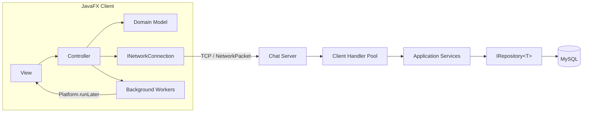

<div align="center">
  

  # X Social

  **A desktop-first social platform for publishing, discovering, and discussing what matters — in real time.**

  [](https://openjdk.org/)
  [](https://openjfx.io/)
  [](https://www.mysql.com/)
  [](#architecture)
  [](#roadmap)
</div>

---

## Overview

X Social is a native desktop social-networking platform built around rich conversations, personalized discovery, and dependable real-time communication. It combines a responsive JavaFX client with a multithreaded client-server architecture and relational persistence through MySQL.

The product is designed as more than a feed: users can publish multimedia posts, build threaded discussions, follow people and hashtags, discover relevant content, exchange private messages, manage subscriptions, and report harmful activity through a dedicated moderation workflow.

> [!NOTE]
> X Social is currently in its bootstrap stage. The JavaFX application entry point and product architecture are in place; features are being delivered incrementally through the roadmap below.

## Product Highlights

### Social experience

- Account registration, authentication, and editable profiles
- Follow and unfollow relationships with follower/following views
- Personalized home feed shaped by interests and activity
- User, post, and hashtag search
- Trending posts and popular hashtags
- Normal, Blue, and Gold account tiers

### Publishing

- Text posts with optional image or video attachments
- Likes, views, sharing, editing, and soft deletion
- Nested replies and threaded conversations
- Automatic hashtag extraction and topic pages
- Content sorting and recommendation flows
- Media galleries on user profiles

### Real-time messaging

- Private one-to-one conversations over TCP sockets
- Online presence and offline message delivery
- Delivery and read states
- Typing indicators
- Saved messages
- Delete-for-everyone flow
- Background media upload and download

### Trust and moderation

- User and post reporting
- Structured review states: waiting, confirmed, and rejected
- Administrative dashboards and platform statistics
- User and content restriction controls
- Domain-specific exceptions with user-friendly error handling

## Architecture

X Social follows MVC at the application level and keeps networking, persistence, and domain concerns behind explicit interfaces.



### Design principles

- **Separation of concerns:** UI, business rules, networking, and persistence evolve independently.
- **Interface-driven boundaries:** controllers depend on contracts rather than concrete database or network implementations.
- **Server-owned persistence:** clients never access MySQL directly.
- **Safe concurrency:** connection handling and background work use managed executor pools.
- **Resilient UI:** background tasks marshal visual updates onto the JavaFX application thread.
- **Domain-aware failures:** authentication, user, post, and networking errors remain explicit and recoverable.

## Core Domain

| Area | Key concepts |
| --- | --- |
| Identity | `Account`, `User`, `Admin`, `NormalUser`, `BlueUser`, `GoldUser` |
| Publishing | `Post`, `Image`, `Video`, `Hashtag` |
| Messaging | `ChatMessage`, `NetworkPacket`, `ChatClient`, `ChatServer` |
| Moderation | `Report`, account restrictions, content restrictions |
| Persistence | `IRepository<T>`, `UserRepository`, `PostRepository`, `MessageRepository` |
| Networking | `INetworkConnection`, `ClientHandler`, connection lifecycle |

## Technology Stack

| Layer | Technology |
| --- | --- |
| Language | Java 21 |
| Desktop UI | JavaFX |
| Architecture | Model-View-Controller (MVC) |
| Networking | TCP sockets, client-server protocol |
| Concurrency | `ExecutorService`, synchronized operations, JavaFX application thread |
| Database | MySQL with direct SQL and relational modeling |
| Persistence pattern | Generic Repository |
| Media | Image and video attachments with background processing |

## Repository Structure

```text
.
├── docs/
│   └── images/                         # README and product visuals
├── src/
│   └── main/
│       └── java/
│           └── com/xsocial/
│               ├── app/                # Application entry point
│               ├── controller/         # UI and workflow controllers
│               ├── model/              # Domain entities
│               ├── repository/         # MySQL persistence adapters
│               ├── network/            # Client-server communication
│               ├── interfaces/         # Stable application contracts
│               └── exceptions/         # Domain-specific failures
└── README.md
```

The repository currently contains the application bootstrap. Remaining packages are introduced as their roadmap milestones land.

## Getting Started

### Prerequisites

- JDK 21 or newer
- JavaFX SDK compatible with the selected JDK
- MySQL 8 or newer
- Git

### Clone the repository

```bash
git clone https://github.com/void-fatima/x-social-platform-simulator.git
cd x-social-platform-simulator
```

The reproducible build configuration and environment template will be added with the foundation milestone. No database credentials should ever be committed; local secrets belong in an ignored environment configuration.

## Roadmap

- [x] JavaFX application entry point
- [x] Product architecture and repository documentation
- [ ] Build configuration and environment profiles
- [ ] Authentication and account hierarchy
- [ ] Profiles, follows, and personalized feed
- [ ] Multimedia publishing and threaded replies
- [ ] Hashtag discovery, search, and recommendations
- [ ] Subscription tiers and account credits
- [ ] MySQL schema and repository layer
- [ ] Multithreaded client-server communication
- [ ] Real-time private messaging and offline delivery
- [ ] Reporting and moderation dashboard
- [ ] Automated tests and release packaging

## Data and Security

- Passwords must be stored as strong salted hashes, never as plain text.
- SQL operations must use parameterized queries.
- Database access remains isolated on the server.
- Network payloads are validated before entering the domain layer.
- Authentication and authorization checks are enforced server-side.
- Logs must not expose passwords, access tokens, private messages, or database credentials.

## Contributing

Focused contributions are welcome:

1. Fork the repository.
2. Create a branch with `git switch -c feature/your-feature`.
3. Keep UI, domain, network, and persistence responsibilities separated.
4. Add tests for new behavior where practical.
5. Open a pull request describing the change and its architectural impact.

## Disclaimer

X Social is an independent software project created to explore desktop social-platform architecture. It is not affiliated with, endorsed by, or sponsored by X Corp. Any referenced trademarks belong to their respective owners.

<div align="center">
  <strong>Publish thoughtfully. Connect instantly.</strong>
</div>
